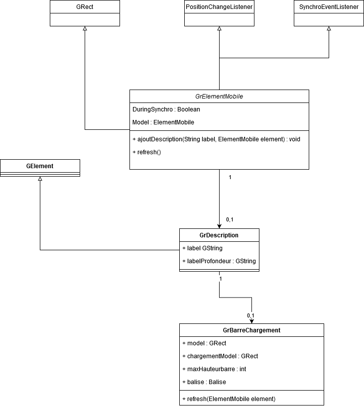
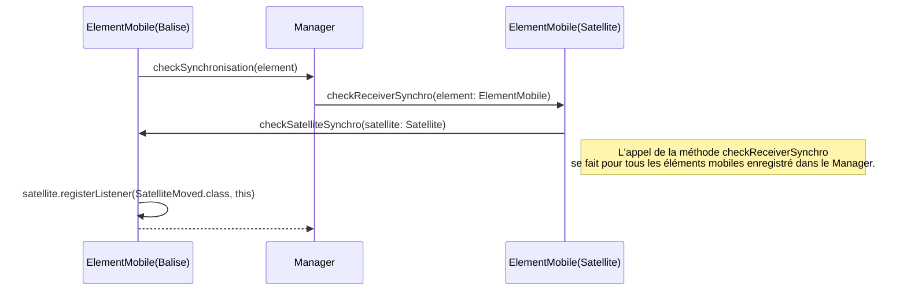
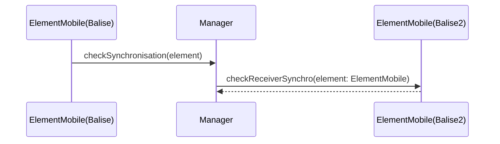

# Projet Satellites & Balises
**Hugo MAHE** & **Gurvan LORANS-CANO**

## Introduction
Pour l'élaboration de ce projet qui consiste à la correction et à l'évolution du code nous avons implémenté différentes fonctionnalités au sein des sources distribuées au début du projet.

## Restructuration du code
Afin de pouvoir s'y retrouver plus facilement dans le projet, nous avons décidé de renommer les classes pour respecter une certaine nomenclature. Ainsi les classes de Déplacement sont préfixées par **_Depl_** et les classes d'états sont préfixées par **_State_**. De plus nous avons restructuré l'arborescence par package afin de s'y retrouver plus facilement. De ce fait, nous avons les packages suivant : 
| Nom | Utilisation |
|--|--|
| deplacement | stocke la classe Deplacement et ses sous-classes |
| deplacement.balise | stocke la classe DeplBalise ainsi que ses sous-classes |
| event | Stocke tous les différents évènements compris au sein du système |
| listener | Va stocker les différents listener qui peuvent être utilisés dans le système |
| model | Va stocker les classes "model" : e.g Satellite, Balise, ElementMobile, ... 
| simulation | Contient les classes utilisées pour la simulation eg. les éléments graphique et la classe simulation | 
| state | Contient tous les différents états utilisés dans le système | 


## Graphique

### GrDescription
Dans un soucis de lisibilité il a été décidé d'enrichir l'interface avec des éléments facilitant le "débogage" du programme, des éléments tel qu'un label ou l'affichage de certains attributs.  

Un objet **_ElementMobile_** est donc associé à une nouvelle classe nommée **_GrDescription_**, cette classe à pour but de fournir des éléments graphique à ajouter sur les **_ElementsMobiles_**, il a été décidé que "par defaut" un **_ElementMobile_** pourrait avoir une description générique composée d'un _Label_ cela permettait d'éviter de la "redondance" de code entre la description d'un satellite et d'une balise. 

```java
public void ajoutDescription(String label, ElementMobile element) {
		// AJOUT DU LABLE GENERIQUE
		this.description = new GrDescription();
		this.description.label = new GString(label);
		this.description.label.setDimension(new Dimension(500, 500));
		Point p = new Point(12, 60);
		this.description.label.setPosition(p);
		this.description.label.setFont(new Font("Arial", 1, 20));
		this.addElement(this.description.label);
	}
```
Cette méthode **_ajoutDescription_** est surchargée dans les classes énoncées plus haut, avec leurs spécificités, par exemple dans le cas d'un **_GrBalise_** sur un fond bleu il fallait choisir un texte blanc mais ce n'est pas possible pour le satellite qui est lui même déjà sur un fond blanc. 

Un point qui peut être amélioré , est qu'une balise avait dès le début une barre de chargement (associé à sa mémoire remplie ou non) mais pas un satellite. Il a été décidé de répliquer ce comportement pour le satellite. Cette décision est arrivée tardivement sur le projet et donc la barre de chargement n'est pas générique à l’élément mobile, on peut donc observer cette fois une redondance dans le code. 

### GrBarreChargement
La barre de chargement dispose d'un comportement relativement simple, à chaque évènement "positionChanged" l'objet GrElementMobile exécute la méthode refresh, cette méthode refresh vient appliquer cette même méthode sur la GrDescription et donc enfin sur la barreDeChargement. 

A chaque refresh la barre de chargement vient regarder le pourcentage rempli de la mémoire et détermine une dimension à adopter équivalent à son remplissage. 

La barre de chargement dispose du code couleur suivant: 

| Couleur| Description |
|--|--|
|Bleu| Partie non remplie de la mémoire |
|Orange| Partie  remplie de la mémoire |
|Verte| La mémoire est entièrement remplie  |

### Diagramme de classe de GrDescription


Si il ne s'affiche pas merci de consulter l'archive.. 

## Correction des concepts

### Gestion des états (State)
Certaines balises ne redescendaient pas suite à leurs synchronisation. Le bug a été repéré grâce au debug possible par l'interface graphique. Ainsi, nous avons pu repéré que ceci était dû à un problème de gestion d'état. Les balises continuait de collecter des données lors de la plongée.
Suite à ce constat, nous avons décidé de mettre en place une notion de state au lieu d'un attribut pour respecter au mieux l'OCP ainsi on peut facilement modifier le comportement d'une balise sans avoir à modifier/ajouter des attributs au sein de la classe balise. Nous avons donc 2 états : 
| Nom | Utilisation |
|--|--|
| StateCollect | Etat dans lequel la balise va récolter ses données |
| StateSynchronisation | Etat dans lequel la balise va remonter à la surface, attendre sa synchronisation, se synchroniser puis replonger à la profondeur à laquelle elle était avant sa remontée |

StateSynchronisation va ainsi stocker le déplacement initial et la profondeur de la balise pour les ré-affecter à sa sortie

### DeplSynchronisation ne se déplace pas
La classe DeplSynchronisation ne concernait en rien un déplacement. L'objectif de cette classe était la gestion de la synchronisation. Ceci pose un problème de conception. Nous avons donc décidé de supprimé cette classe et d'implémenter la classe DeplStandBy pour la remplacer.
En effet lors de la synchronisation une balise ne doit plus se déplacer. De plus le DeplStandBy était une notion du cahier des charges qui manquait à l'archive original. 
La gestion de la synchronisation quand à elle a été déportée dans la classe StateSynchronisation car ses actions concernaient le comportement de la balise ce qui par définition correspond à un état.
 
## Un Manager trop dépendant

Un autre soucis majeur de la conception faites dans l'archive original concernait le DIP non respecté au sein du Manager. En effet, celui-ci se reposait sur des éléments **concrets** tel que _Balise_ et _Satellite_ au lieu de se reposer sur des éléments **abstraits**. La correction a donc été élaborée en 2 temps.

### Gestion du tick
Le manager se reposant sur les 2 classes concrète du système nous avons corrigé ceci pour le tick. Ainsi nous avons supprimé les listes concrètes pour les remplacer par des listes abstraites. 

Ainsi : 
```java
ArrayList<Satelitte> sats = new ArrayList<Satelitte>();
ArrayList<Balise> bals = new ArrayList<Balise>();
```
devient 
```java
Set<ElementMobile> elMobs = new HashSet<>();
```

et les méthodes associées à l'ajout d'objet et de leurs ticks passe de : 
```java
public void addBalise(Balise bal) {
	bals.add(bal);
	bal.setManager(this);
}

public void addSatellite(Satelitte sat) {
	this.sats.add(sat);
	sat.setManager(this);
}

public void tick() {
	for (Balise b : this.bals) {
		b.tick();
	}
	for (Satelitte s : this.sats) {
		s.tick();
	}
}
```
à simplement : 
```java
public void addElement(ElementMobile elMob) {
	this.elMobs.add(elMob);
	elMob.setManager(this);
}

public void tick() {
	for (ElementMobile elMob : this.elMobs) {
		elMob.tick();
	}
}
```

On voit clairement ici qu'en plus de respecter le DIP, on simplifie et on réduit le code. Car nous agissons exactement de la même manière quelque soit l'élément concret pour le tick étant donné que cette méthode est incluse dans l'abstraction ElementMobile.

### Un abonnement trop concret
La seconde partie du Manager concernait la gestion de l'abonnement. Pour info nous avions les méthodes suivantes : 
```java
public void baliseReadyForSynchro(Balise b) {
	for (Satelitte s : this.sats) {
		s.registerListener(SatelitteMoved.class, b);
	}
}
public void baliseSynchroDone(Balise b) {
	for (Satelitte s : this.sats) {
		s.unregisterListener(SatelitteMoved.class, b);
	}
}
``` 

On voit ici qu'on utilise des éléments concrets. Ceci pose donc problème au niveau du **DIP**. Nous devrions avoir des méthodes qui se reposent uniquement sur **ElementMobile**, la classe abstraite.

Afin de pouvoir se reposer sur cette abstraction nous mettons donc en place un Double-Dispatch. Pour ce faire, dans ElementMobile nous définissons 2 méthodes qui sont : 

#### Modification du modèle

#### Séquence d'appel de méthode
*Pour une balise s'abonnant aux déplacements d'un satellite*


*Si l'élément secondaire analysé était du type Balise (liaison Balise-Balise)* 


Comme on peut le voir dans le diagramme ci-dessus le double dispatch n'a aucun impact sur les liaisons qui n'ont pas lieu d'être. En effet la balise n'étant pas un receveur possible, sa méthode `checkReceiverSynchro` n'est pas surchargé et n'a donc aucun effet sur le programme (méthode vide)

#### Explications textuelles
```java
	public void checkReceiverSynchro(ElementMobile other) {}

	public void checkSatelliteSynchro(Satelitte satelitte) {}
```

Ici `checkReceiverSynchro` sera la méthode non déterministe. Ainsi quand on l'appelle on aura aucune idée de l'élément concret  qui sera utilisé pour appelé la méthode. De plus nous aurons aucun moyen de savoir le type concret du paramètre other. 

Nous avons donc 2 inconnues. Pour déterminer une des 2 nous allons pouvoir surcharger la méthode `checkReceiverSynchro` dans Satellite. Ainsi dans le code sur la méthode surchargée nous saurons que le `this` correspond à une instance de Satellite. 

Dans le code de cette surcharge nous appellerons donc la méthode `checkSatelliteSynchro`  en passant this en paramètre.

Ainsi nous aurons qu'à surcharger la méthode `checkSatelliteSynchro` pour indique aux classes concrètes qui doivent émettre aux satellites. 

De ce fait, dans `Balise` nous surchargeons donc `checkSatelliteSynchro`

Ainsi dans le manager nous n'aurons qu'à implémenter la méthode suivante : 

```java
public void checkSynchronisation(ElementMobile element) {
	for (ElementMobile elMob : this.elMobs) {
		elMob.checkReceiverSynchro(element);
	}
}
```
Comme on peut le voir le paramètre est abstrait et le type de la liste parcourue également.

A noter que pour `unregister` un listener, nous avons utilisé exactement le même mécanisme mais avec des méthodes ayant pour suffixe : `SynchroDone`

## BaseNavale 
Le pattern que l'on vient de démontrer avec ce double dispatch à été également appliqué pour la liaison Satellite vers BaseNavale (représentée en un carré rouge dans l'interface) 

C'est une première itération de cette méthode de synchronisation et nous rencontrons encore quelques bugs sur son implémentation. 

La spécificité pour la baseNavale est que cette dernière doit connaitre les satellites proches d'elle et qui sont en état de **_StateSynchroBase_**, c'est le satellite qui envoi au manager une demande de synchronisation via la méthode checkSynchro(Satellite), le satellite devient alors en attente d'un évènement qui est **_WhenBaseNavaleAProximite_** et lorsque ce signale est reçu on procède alors au "vidage" de la mémoire du satellite et on passe à l'état de satellite suivant qui correspond à son état initial : **_StateCollectSatellite_** _(StateSatelliteCollect n'étant quitté que par un retour true de la méthode memoryFull())_ . 

## Bug connus et non corrigés
Le programme n'est pas exempté de bug, cette liste permet d'évoquer ce que nous connaissons ainsi que nos pistes de résolution...
| Reference | Description du bug | Piste de résolution |
|--|--|--|
|BaseNavale01| La base navale vide l'ensemble des satellite remplis qu'ils soient à portée ou non | Envoyer le satellite recevant l’évènement de synchronisation et tester si c'est bien le bon satellite à portée que l'on vide
|SatelliteBalise01| La balise peut parfois envoyer d'avantage de données que le satellite peut accepter (elle se vide entièrement peut importe si il y a la place ou non sur le satellite) | Rajouter une condition de mémoire pleine qui permettrait de quitter l'état de collecte directement pendant l'envoi de données (Côté satellite et Balise) 

